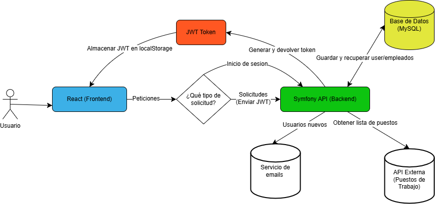

# App-employees

## Resumen del Proyecto

Este proyecto está dividido en dos partes principales: el front-end y el back-end.

### Front-end

El front-end está construido con **React 19** y utiliza **SweetAlert2** para alertas interactivas, **Axios** para el manejo de peticiones HTTP y **Bootstrap 5** para estilos y diseño responsivo.

#### Tecnologías Utilizadas:
- 
- 
- 
- 

Para más detalles, consulta el [README del Front-end](./front-end/README.md).

### Back-end

El back-end utiliza **Symfony 6.4** junto con **JWT Authentication** para la gestión de usuarios y autenticación. La base de datos utilizada es **MySQL**.

#### Tecnologías Utilizadas:
- 
- 
- 
- 

Para más detalles, consulta el [README del Back-end](./back-end/README.md).

## Diagrama del Proyecto

A continuación se muestra un diagrama que ilustra la arquitectura del proyecto:

## 📄 Licencia

Este proyecto está bajo la Licencia MIT. Consulta el archivo [LICENSE](LICENSE) para más detalles.